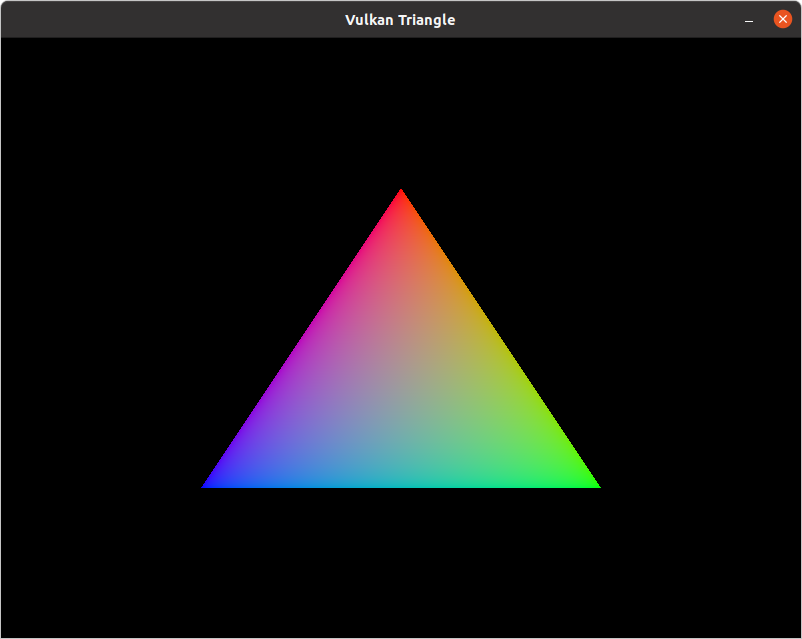

The [Vulkan triangle](https://vulkan-tutorial.com/Drawing_a_triangle/Setup/Base_code) in Nim.



To develop, [install Nim](https://nim-lang.org/install.html) and do:

```
nimble dev
```

Or to make a release build:

```
nimble build -d:release
```
